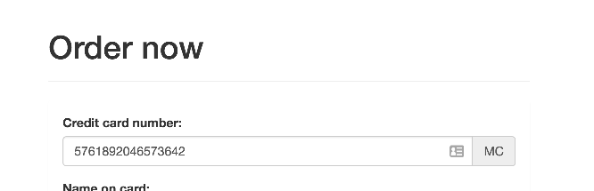

# JavaScript &ndash; zadania
## Inputy i formularze

Zadania sprawdzające umiejętność korzystania z inputów i formularzy.

Każde zadanie ma swój plik **HTML** i powinno być rozwiązane w osobnym pliku JavaScript (puste pliki są już przygotowane w odpowiednim folderze).


### Zadanie 1 &ndash; do rozwiązania z wykładowcą

Walidacja karty kredytowej.
Zadanie polega na walidacji kart kredytowych wpisywanych w formularz na stronie. Walidacja ma następować w czasie rzeczywistym (czyli po wprowadzeniu każdej cyfry).
Nazwa karty ma być wpisana, jak tylko jest możliwe jej ustalenie.
Poprawność karty ma być pokazana po wpisaniu odpowiedniej liczby cyfr.




### Zasady rozpoznawania kart:
1. Karty Visa zaczynają się od cyfry 4.
1. Karty Mastercard zaczynają się od cyfry 5.
1. Karty American Express zaczynają się od cyfry 3. Następną cyfrą musi być 4 lub 7.

### Zasady walidacji kart:
1. Karty Visa mają od 13 do 16 cyfr.
1. Karty Mastercard mają równo 16 cyfr.
1. Karty American Express mają równo 15 cyfr.

Zasady walidacji kart są uproszczone (nie powinniście ich stosować w rzeczywistych projektach).
Jeżeli chcesz poznać prawdziwe zasady walidacji kart kredytowych, to są one opisane tutaj:
https://en.wikipedia.org/wiki/Bank_card_number
https://en.wikipedia.org/wiki/Luhn_algorithm

### Zadanie 2
Na stronie znajduje się formularz do zamówienia. Jest w nim sekcja odpowiedzialna za wystawienie faktury.
Napisz kod JavaScript, który spowoduje, że sekcja ta jest widoczna tylko i wyłącznie wtedy, kiedy zaznaczony jest checkbox "Chcę otrzymać fakturę".

### Zadanie 3
Na stronie znajduje się formularz do zamówienia pizzy. W formularzu znajduje się pole z checkboksami, w którym użytkownik może wybrać sobie dodatki.
Cena każdego z dodatków jest trzymana w atrybucie ```data-price```.
Napisz takie eventy, żeby po zaznaczeniu checkoxa wyświetlała się poprawna kwota zamówienia oraz po wysłaniu formularza wyświetlił się alert z wyliczoną kwotą.
Zwróć uwagę na dwa specjalne checkboksy:
* none &ndash; powinien odznaczyć wszystkie inne opcje,
* all &ndash; powinien zaznaczyć wszystkie inne opcje (poza none).


### Zadanie 4
Na stronie znajduje się select i trzy obrazki.
Każdy z obrazków jest przypisany do jednego z wyborów w selekcie. Napisz kod javaScript w taki sposób, żeby widoczny był tylko ten obrazek, który został wybrany.

### Zadanie 5
Na stronie znajduje się formularz, który odsyła do strony ```http://api.coderslab.pl/showpost.php```.
Napisz walidację tego formularza w taki sposób, żeby wysyłany był tylko i wyłącznie wtedy, kiedy spełnione zostaną następujące warunki:

1. Email zawiera w sobie @.
2. Imię jest dłuższe niż pięć znaków.
3. Nazwisko jest dłuższe niż pięć znaków.
4. Hasło i hasło drugie są identyczne.
5. Checkbox musi być zaznaczony.

Warunek dla chętnych. Dodatkowe. Hasło ma mieć co najmniej pięć znaków (w tym co najmniej jedną liczbę i jedną literę).

Zauważ, jak dane wyświetlane są na stronie docelowej (jak ich nazwy są skorelowane z kodem HTML). Spróbuj pozmieniać atrybuty ```name``` i zobacz, jak się zmieniają wysyłane dane (np. sprawdź, co się stanie, jak dwa inputy mają taką samą nazwę).
Uwaga, jest to ważne miejsce współpracy frontendowców z backendowcami.


### Zadanie 6
Na stronie znajduje się tablica z wynikami w lokalnych mistrzostwach piłkarskich. Poniżej znajduje się formularz, który wypełniają wszyscy sędziowie po ukończonych rozgrywkach.
Napisz kod JavaScript w taki sposób, żeby po wybraniu odpowiednich drużyn nastąpiła walidacja:
1. Obie drużyny muszą być różne.
2. Liczba goli powinna być nieujemna.

Jeżeli formularz zostanie zweryfikowany poprawnie, odpowiednia informacja o wyniku spotkania powinna pojawić się w tablicy.
