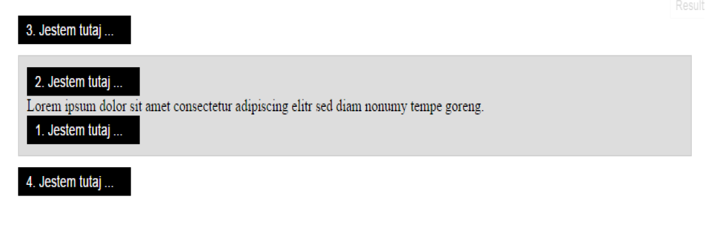

# jQuery &ndash; zadania
# Modyfikowanie elementów

Zadania rozwiąż w pliku **app.js**.
Pamiętaj, żeby oddzielać zadania komentarzami i pisać czytelny, dobrze sformatowany kod.

### Zadanie 1
Znajdź w pliku **index.html** element o **klasie** ```people```. Stwórz odpowiednią funkcję, wewnątrz której ustaw event ```click``` na przycisku ```dodaj```.
Po kliknięciu wykonaj następujące czynności:

1. Pobierz do zmiennej wartość wpisaną do pola o **id** ```addUser```.
2. Pobierz do zmiennej wartość wpisaną do pola o **id** ```age```.
3. Wstaw nowy element na koniec listy, ustaw jej wiek jako atrybut ```data```.
4. Po każdym wstawieniu elementu wywołaj osobną funkcję, która będzie ustawiała dany kolor dla elementu **li** w następujący sposób:
  * zielony dla osób w wieku do 15 lat,
  * niebieski dla osób mających od 16 do 40 lat,
  * brązowy dla osób mających 41 lat i więcej.

### Zadanie 2
Znajdź w pliku **index.html** element o **klasie** ```where-i-am```, następnie stwórz odpowiednią funkcję, wewnątrz której stwórz elementy **span** i dodaj je w odpowiednie miejsca według obrazka poniżej.
W miejsce trzech kropek wstaw nazwę funkcji, której używasz,   np. ```Jestem tutaj append```. Nie zmieniaj kodu HTML.


